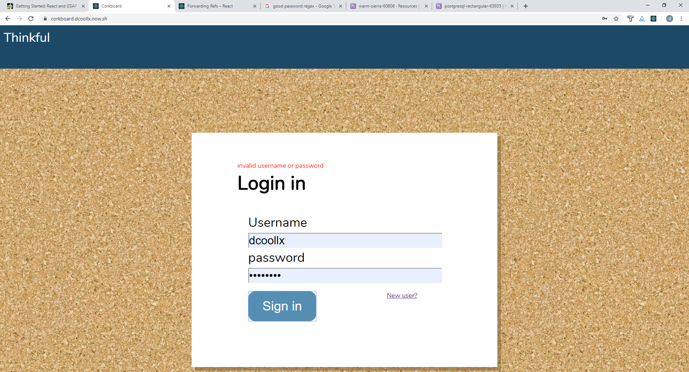
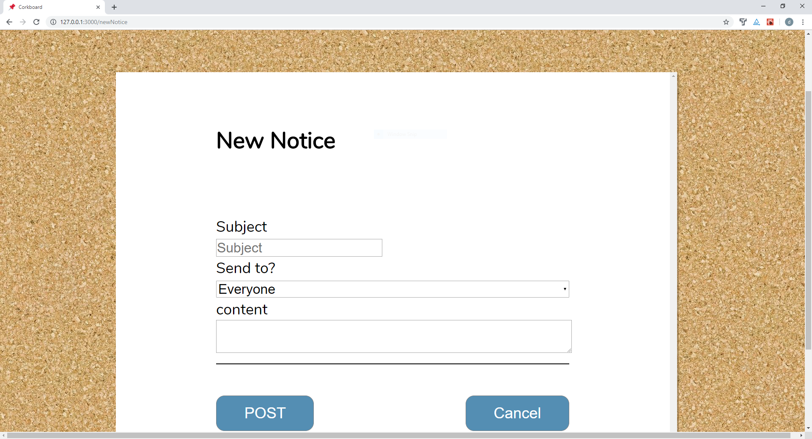

# CorkBoard
___
The Company Message App
# Welcome to CorkBoard!
## Tech Stack
### frontend
 - Reactjs
 - Markdown
 - Siema
### backend
 - Node
 - express
 - shortId
 - Mocha
___

### welcome to corkboard, the _easiest_ way to communicate to your team!

### How to use corkboard.
1. make an Account 
2. create a team.
    1. open settings
    2. click create a team
    3. Post a message!
        - use the [+](\'/newNotice\') button to create a Messages just like this one.
        - Coarboard Messages supports HTML & [Markdown](https://www.markdowntutorial.com/)
    4. Comment on Messages\n\u003eafter a Message is created, you team members can comment on them!
    5. Have Fun!
    
    

